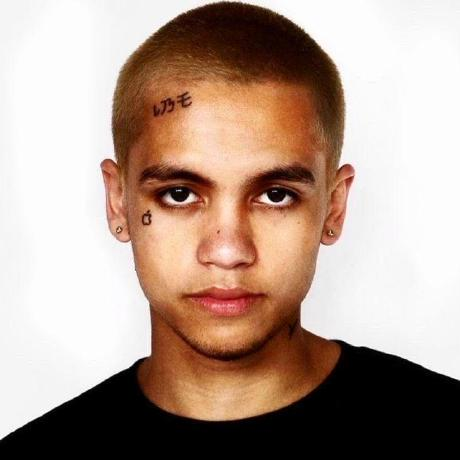
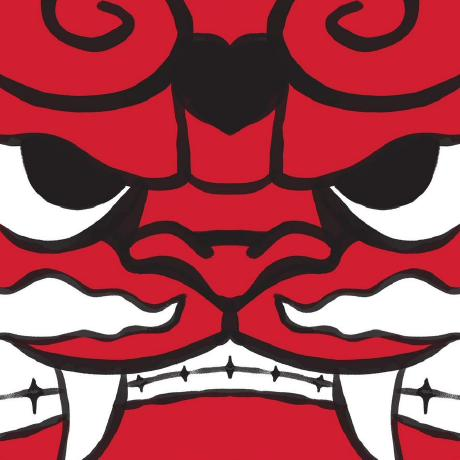

# Authors & Contributors

  

ReTag consists of three college students majoring in interactive media design and systems engineering at [ICESI University](https://www.icesi.edu.co/). **Natalia**, **Jorge** & **Alejandro**. And the project is the semester-long assignment for the web programming course

## Our Team

|                                   Avatar                                    |             Name             |      Role      |                                                              GitHub                                                              |
| :-------------------------------------------------------------------------: | :--------------------------: | :------------: | :------------------------------------------------------------------------------------------------------------------------------: |
|        |  **Natalia _(@nattalic)_**   |    Creator     |       |
|      | **Jorge _(@jorgevasco246)_** |    Creator     |  |
|  | **Alejandro _(@alejmmtz)_**  | Creator & Lead |       |

## Thanks to

- **Depop** for the initial inspiration.

