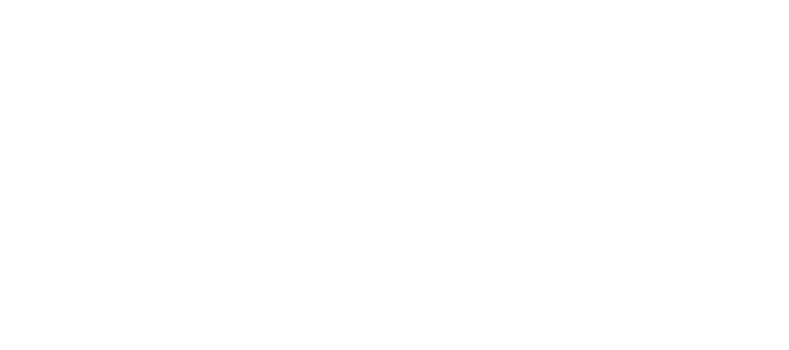
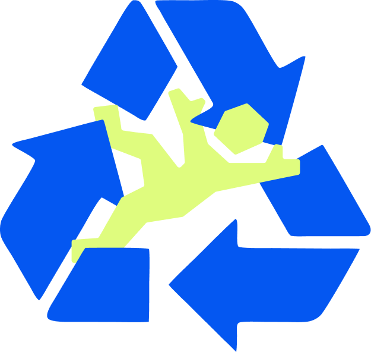
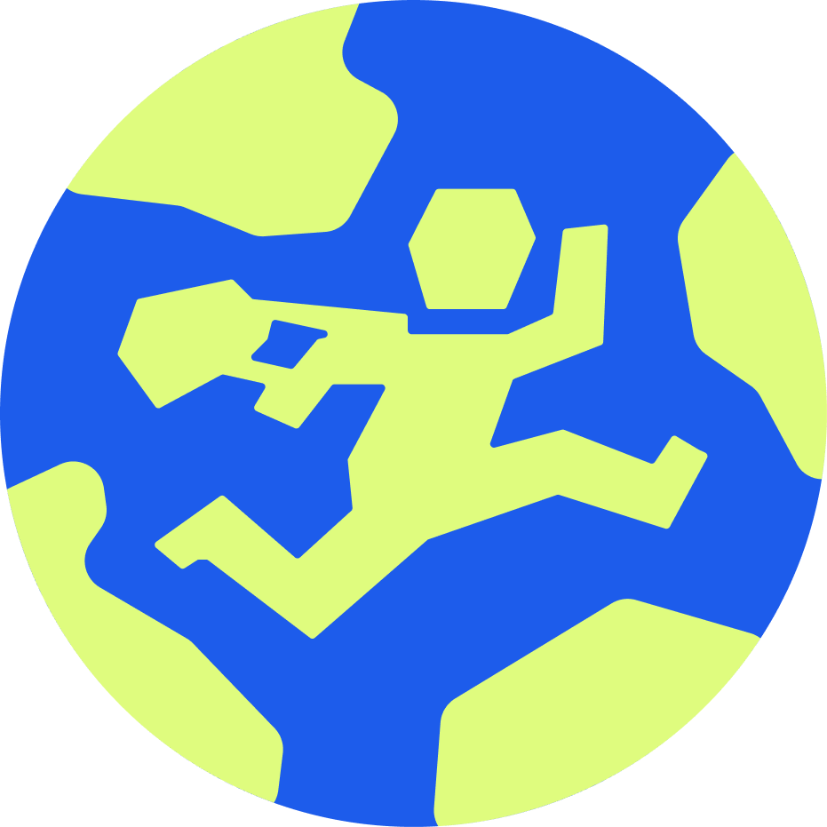

<p align="center">
  
</p>

<div>

<h3 align="center"><em> "Retagging the way you treat your Garments."</em></h3>

</div>

<p align="center">
  <strong>
ReTag is a full-stack university project with the philosophy of serving as a digital platform that drives the growth of circular fashion. We are currently working with Nest.js, Next.js, TypeORM, and a PostgreSQL database to provide industry-level technology that ensures the project’s goals are met. 
</strong><br>

</p>

</br>
  <p align="center">
    <a href=""><strong>View Demo <em>(Currently in Development)</em></strong></a>
    &middot;
    <a href="https://github.com/alejmmtz/ReTag-App/issues/new?labels=bug&template=bug-report---.md"><strong>Report Bug</strong></a>

  </p>
</br>
<div align="center">


</div>

</br>

## Table of Contents

- [Table of Contents](#table-of-contents)
- [About the Project](#about-the-project)
- [Our Main Features](#our-main-features)
- [Architecture](#architecture)
  - [Why SPA?](#why-spa)
- [Performance](#performance)
- [Installation](#installation)
  - [Prerequisites](#prerequisites)
  - [NestJs Settings](#nestjs-settings)
  - [Setup](#setup)
- [Where to Go](#where-to-go)
  - [Basic Usage](#basic-usage)
- [API Reference](#api-reference)
- [Development](#development)
- [Testing](#testing)
- [Our Team](#our-team)
- [Roadmap](#roadmap)

</br>

## About the Project

</br>

<p align="center">
  
</p>

<p>
As fashion enthusiasts, we love new trends and solutions to the excessive waste caused by the modern industry. And it’s a priority for us to give these vital elements of healing such as circular fashion, the visibility they need to take off and become part of everyday life. At ReTag, we focus precisely on that, providing a platform and a consistent, conscious push. Because we need to learn to take things more slowly and start embracing a world of alternatives to conventional clothing purchases.

Currently, there are multiple physical and digital channels to meet this demand, including flea markets, specialty stores, online platforms, and apps. However, current apps present critical problems that limit the adoption of circular fashion, hinder transactions, and place a heavy cognitive burden on users.

ReTag will build an ecosystem rather than offering just a single, one-off feature. It will address gaps in interactivity, transactional capabilities, and security by providing an experience that is low-cognitive-load for the seller and highly engaging for the buyer. It will redefine the concept of traditional e-commerce by merging physical, hybrid, and virtual environments through dynamic scrolling, innovative garment presentations, and flexible exchange options, transforming the way secondhand clothing is sold and purchased.

Finally, at ReTag, we aim to provide the best user experience. We incorporate our eco-friendly philosophy into every aspect of our app and proudly exclude technologies such as artificial intelligence from our experience, because beauty comes from human driven community. Join us, were we can help reduce our impact on the planet while enjoying our shared passion for dressing well.</p>
</br>

## Our Main Features

- **Feature 1 - ReTag Market**: Offering, selling, trading, and buying secondhand clothing.
  - **For Offers:** Allows for detailed description of the item, reduces the cognitive load of describing it, offers autocomplete options, automatically calculates information about the item, tracks relevant statistics, provides an organized view of all listed products and their options, features a dashboard with insights, and includes a transactional mode.
  - **For sales:** Tracking of sales progress for both buyer and seller, options to contact the seller, a customer support menu, positive messages that reinforce the purchase, and a sales funnel mockup.
  - **For exchanges:** Option to have an exchange menu where features are compared so the user can determine whether the trade-in is worthwhile and what it entails; as if it were a personal experience, it can include background music and a progress bar.
  - **For purchases:** Order tracking for the buyer; the ability to view posts and their content; product statistics relevant to the buyer; information about the brand being purchased (if it’s in the database) and its history, finally the environmental impact of the purchase
    </br></br>

- **Feature 2 - Social Feed**: In the app, we’ll manage a social media feed that hosts different types of posts, including:
  - **Show Off Posts:** Related to Garments purchased by users who later show them off on the app, thereby increasing the visibility and completeness of the transactions
  - **Community Posts:** Related to progress in our advocacy for circular fashion and the environment, where users can promote an eco-friendly lifestyle through community efforts.
  - **Offer Posts:** Offers from Garment sellers in post format to increase product visibility and secure a spot in the app's feed. [(See Feature 1 / For Offers)]()
  - **Event Posts:** Related to events hosted by clothing stores and the app used to invite the community to a specific gathering based on shared interests and goals

  All posts can have likes, captions, and creation dates, and can be viewed later from the user’s profile.
  In addition to the main feed, there’s a horizontal Reels-style search feed where you can view Garments on offer using a pseudo-algorithm. And, of course, there’s also the product search tab with a filter search bar.
  </br></br>

- **Feature 3 - Events at ReTag:** It allows users to discover, participate in, and share events related to circular fashion, promoting interaction and a sense of community.

  And it gives every verified store the opportunity to create an event for its followers, with the goal of bringing the entire community together and establishing the hybrid connection that is central to our business model.

  There are two types of events:
  - **In-person:** In-person events are invitations to local events in which ReTag continues to participate, but only as an invitation platform.
  - **Virtual:** While virtual events are often hosted by us, where users can upload their clothing and offer content based on the proposed theme.
    </br></br>

- **Feature 4 - Who Are You? On Another Level**: At ReTag, we take your identity and your participation in our platform very seriously. We want both users and stores to be able to take control of their content and sales to the next level. Furthermore, our main goal is for our app to foster a constant sense of community where each of us feels the importance of our role in the project. We provide personalized support and tailor your experience to your needs.

## Architecture

In this project, we will use a modern web app architecture based on the **single-page application(SPA)** pattern.

### Why SPA?

It provides a fast rendering after the initial load _(although initial load times can be slow)_ and a highly responsive user experience. It's suitable for large and growing apps. This makes for a smoother, faster user experience without annoying page reloads.

- **Server Side**: Our backend is being built using the **_Nest.js_** framework. We follow modular organization practices and map database entities using **_TypeORM_**.
- **Client Side**: Our front end is being built using **_Next.js_** and **_React_** to create a modern, user-friendly, and high-performance UI.
- **Database**: Thanks to **_PostgreSQL_**, we can create a robust and comprehensive relational database that allows us to provide users with all the information they need for their experience.

## Performance

</br>
<p align="">
  
</p>

It's not you. It's us... we haven't figured out this part of our project yet.

## Installation

### Prerequisites

- **Node.js version 18.0.0 or superior**
- **npm / yarn / pnpm**
- **Docker**

### NestJs Settings

```bash
# Cli
npm install -g @nestjs/cli
```

### Setup

```bash
# Clone the repository
git clone https://github.com/alejmmtz/ReTag-App.git

# Install dependencies
cd server
npm install
```

</br>

## Where to Go

### Basic Usage

```javascript
`http://localhost:${port}/`;
```

## API Reference

</br>
<p align="">
  
</p>

We are currently working on the server and its endpoints; once that work is complete, we will focus as quickly as possible to create a complete documentation. **[Documentation on Progress](a)**.

## Development

To start contributing to the development:

```bash
# Deploy Docker project composition
docker compose up -d

# Deploy Nestjs Server
cd server
npm run:start dev
```

## Testing

</br>
<p align="">
  
</p>

It's not you. It's us... we haven't figured out this part of our project yet.

## Our Team

<p align="">
  
</p>

ReTag consists of three college students majoring in interactive media design and systems engineering at [ICESI University](https://www.icesi.edu.co/).

<a href="https://github.com/othneildrew/Best-README-Template/graphs/contributors">
  
</a>

</br>

Please see [AUTHORS.md](./AUTHORS.md) for details.

## Roadmap

Check our [ROADMAP.md](./ROADMAP.md) for planned features.

---

<p align="center">
  Made with ❤️ for the planet by <a href="https://github.com/Nattalic"><strong>Natalia</strong></a>, <a href="https://github.com/Jorgevasco246"><strong>Jorge</strong></a> & <a href="https://github.com/alejmmtz"><strong>Alejandro</strong></a>.
</p>
